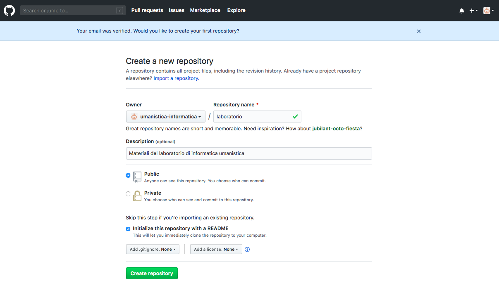

# Lezione 13

## Github e pubblicazione del sito web

In questa lezione parliamo di:

 * repository per lo storage e l'update di codice software
 * creazione di un account sul sito di un provider online (github)
 * creazione di un repository Git
 * installazione di una applicazione desktop per gestire il nostro codice
 * creazione di una o più pagine web al progetto e pubblicazione

#### Version Control System (VCS)
Sistemi VCS permettono di registrare i cambiamenti di un file (o di un gruppo di file) nel corso del tempo, salvando versioni diverse degli stessi file. Permettono ad un utente:

 * tornare a versioni precedenti del file, eliminando le ultime modifiche
 * comparare versioni differenti dello stesso file (prima e dopo dei cambiamenti)
 * vedere chi ha modificato per ultimo i/il file, quando e su cosa ha apportato modifiche
 * recuperare file

Alcuni sistemi VCS, chiamati DVCS (Distributed Version Control Systems) consentono di lavorare collaborativamente sul codice, che è:

 * depositato in un deposito centrale remoto (online, e.g. Github)
 * ogni collaboratore ha una copia speculare dei file sulla propria macchina (**client**), inclusiva di tutti i file **per ogni versione** nel tempo (_snapshots_) e della **storia dei cambiamenti** dei file.

Se il server online ha **problemi**, ogni client ha una copia speculare che può essere copiata nel repository centrale. Viceversa, se un client ha problemi, può recuperare il codice online e copiarlo localmente.

Tra i sistemi VCS più noti abbiamo quelli implementati da Dropbox (file di ogni tipo), Google Docs (documenti testuali) e **Github** (codice software).

#### Un progetto su Github

Un progetto Git (o **repository**) è composto da una serie di _snapshot_ dei file che modifichiamo. Le modifiche sul repository vengono salvate nel momento in cui decidiamo di salvare una versione (non automaticamente ad ogni modifica!).

Quando vogliamo salvare le modifiche (e quindi creare uno snapshot dei file) creiamo un **commit**, che include:

 * informazioni sui cambiamenti apportati ai file
 * un riferimento al commit precedente (per creare la sequenza di commint/snapshot)
 * un _hash code name_ (una stringa numerica di 40 caratteri alfanumerici) ovvero un identificativo univoco del **nuovo** contenuto dei file, calcolato sulla base dei contenuti dei file.

Un progetto (o repository) è fondamentalmente un insieme di commit.

In un progetto Git possiamo:

 * **clonare** un repository online (remoto) sul nostro computer (locale)
 * lavorare singolarmente sul codice locale
 * fare **push** dei nostri file sul repository, ovvero caricare i cambiamenti fatti ai nostri file localmente e aggiornare il repository online.
 * fare **pull** dei file online, precedentemente caricati (push) da altri utenti/nostri collaboratori sul repository online, e scaricare i file aggiornati

_**ATTENZIONE!** Questa è la parte più delicata di un lavoro collaborativo (i.e. caricare modifiche online che non siano **in conflitto** con le modifiche fatte da altri collaboratori del repository)._  

Le modifiche caricate online finiscono in un **branch** principale chiamato normalmente _master_. Possono esistere diversi branch, in cui collaboratori lavorano su percorsi paralleli dello stesso codice senza intralciarsi.

Il **push** (caricamento) di file sul repository online avviene nelle seguenti fasi, che corrispondono ad uno **status** dei nostri file.

 * modifichiamo i nostri file localmente (status dei file: **modified**)
 * selezioniamo quali file vogliamo caricare online al prossimo _commit_ (status dei file: **staged**)
 * i file _in stage_ vengono presi e uno snapshot (commit) permanente viene creato sul repository locale (status dei file: **committed**)
 * if file _committati_ vengono caricati online (**push**)

#### 1. Creare un account su github

 1. aprire il browser e andare alla pagina [https://github.com/join](https://github.com/join)

 2. inserire username, la mail e una password.

**N.B.** Lo _username_ che scegliete farà pare della URL del sito finale! lo username può essere riconducibile a voi, alla persona/azienda per cui fate il sito, o a nessuno.  
La _password_ deve contenere lettere minuscole, maiuscole, almeno un numero e almeno un carattere speciale (e.g. `;,:.#`)

3. se non vengono segnalati errori scorrete la pagina verso il basso e premete sul tasto `Verifica`

4. eseguite le operazioni richieste sul CAPTCHA (in genere vi viene chiesto di premere su delle frecce per ruotare una immagine finchè non è nella posizione corretta. Può chiedere di ripetere l'operazione più volte)

5. quando compare la spunta verde, potete premere sul bottone `Next: Select a plan`

6. selezionate l'opzione gratuita a sinistra, premendo sul bottone `Choose Free`

7. Selezionate i box per rispondere alle domande e cliccate su `Complete setup` (oppure saltate cliccando direttamente su `Skip this step`)

8. Vi viene chiesto di verificare la vostra email.

9. Andate nella vostra email e premete il bottone `Verify email address`

10. Venite reindirizzati nella pagina del vostro account su github per creare un nuovo repository (vedi sotto)

#### 2. Creare un repository remoto

11. inserite il nome del repository (progetto) che volete creare (`repository name`)

12. assicuratevi che la radio box selezionata sia `Public`

13. spuntate la radio box `Initialize this repository with a README`

14. cliccate sul bottone `Create repository`

15. venite reindirizzati sulla pagina github del vostro repository. Well done!

**PRENDETE NOTA** della URL del vostro sito (in alto nella barra del browser). Come vedrete sarà una URL nella seguente forma (le parentesi `[]` sono qui aggiunte per distinguere le parti variabili da quelle comuni a tutti)

`https://github.com/[nome-utente]/[nome-repository]`

#### 3. Applicazione client per gestire il codice: SourceTree

Per caricare il nostro codice sul repository online (ed eventualmente per scaricare il codice modificato dai nostri collaboratori) possiamo:

 * utilizzare un terminale (una interfaccia per inserire istruzioni in un linguaggio specifico -- git -- e comunicare direttamente con la nostra macchina)
 * utilizzare una GUI (graphical user interface) per semplificare il processo di modifica/stage/commit/push

In questo corso utilizziamo [SourceTree](https://www.sourcetreeapp.com/)

**ATTENZIONE!** Per problemi di compatibilità con vecchi sistemi operativi non aggiornati, non possiamo utilizzare l'utlima versione di SourceTree e dobbiamo selezionare una versione precedente del software SourceTree. Putroppo il sito non offre informazioni su quale versione sia compatibile con il proprio computer, quindi faremo delle prove, ovvero:

1. apriamo il browser e andiamo alla pagina [https://www.sourcetreeapp.com/download-archives](https://www.sourcetreeapp.com/download-archives)

2. a seconda del nostro sistema operativo guardiamo nella tabella che ci serve (Mac o Windows) e selezioniamo un file `zip` (Mac) o `exe` (Windows) da scaricare

3. clicchiamo sul link `ZIP/EXE` a destra

3. accettiamo la licenza per l'utilizzo e premiamo di nuovo `Download`

4. andiamo nella cartella `Download` del nostro computer

5. clicchiamo sul file .exe (Windows) o .zip (Mac)

  * se ci da un **messaggio di errore** e non fa aprire il file zip/exe: cancelliamo il file dai Download, torniamo sul [sito web](https://www.sourcetreeapp.com/download-archives) e scarichiamo lo zip/exe successivo nella tabella
  * se non da errore, abbiamo trovato la versione compatibile con il nostro sistema

6. clicchiamo sul file dell'applicazione _unzippata_ e si apre l'interfaccia di SourceTree

#### 4. Creare un sito del progetto

#### Lavorare collaborativamente su un repository git

#### Link utili (alternativi)
1. [Come creare un account su github](https://www.wikihow.com/Create-an-Account-on-GitHub)

2. [Come creare un repository e una pagina di progetto su github](https://pages.github.com/)
  * dopo l'immagine trovate due bottoni: User or organization | site Project site
     * selezionate il bottone **Project site**

  * trovate altri due bottoni: Choose a theme | Start from scratch
     * selezionate **Start from scratch**
  * seguite il resto delle istruzioni

3. Per una spiegazione approfondita del funzionamento di Git vedi il file pptx in questa cartella.
