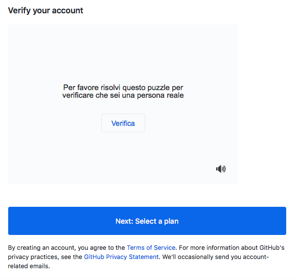
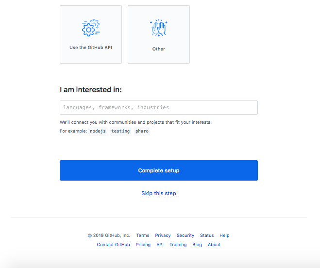
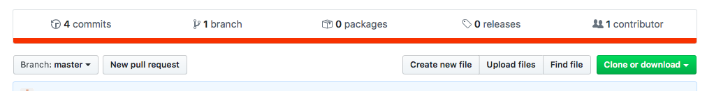
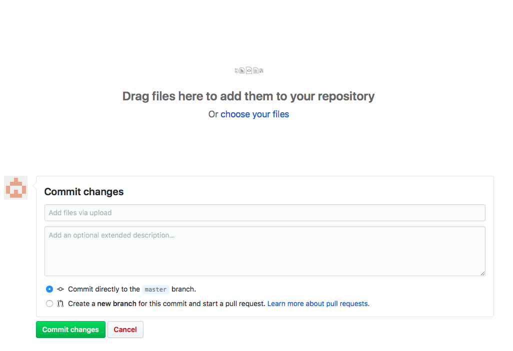
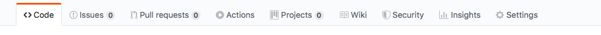
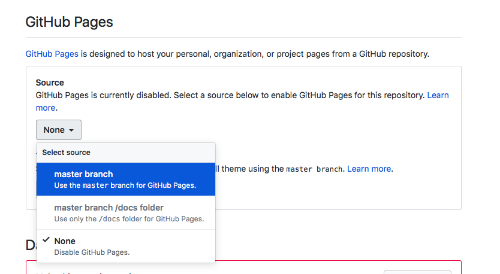

# Lezione 13

## Github e pubblicazione del sito web

In questa lezione parliamo di:

 * repository per lo storage e l'update di codice software
 * creazione di un account sul sito di un provider online (github)
 * creazione di un repository Git
 * upload dei file del sito sul repository remoto
 * pubblicazione del sito

#### Version Control System (VCS)
Sistemi VCS permettono di registrare i cambiamenti di un file (o di un gruppo di file) nel corso del tempo, salvando versioni diverse degli stessi file. Permettono ad un utente:

 * tornare a versioni precedenti del file, eliminando le ultime modifiche
 * comparare versioni differenti dello stesso file (prima e dopo dei cambiamenti)
 * vedere chi ha modificato per ultimo i/il file, quando e su cosa ha apportato modifiche
 * recuperare file

Alcuni sistemi VCS, chiamati DVCS (Distributed Version Control Systems) consentono di lavorare collaborativamente sul codice, che è:

 * depositato in un deposito centrale remoto (online, e.g. Github)
 * ogni collaboratore ha una copia speculare dei file sulla propria macchina (**client**), inclusiva di tutti i file **per ogni versione** nel tempo (_snapshots_) e della **storia dei cambiamenti** dei file.

Se il server online ha **problemi**, ogni client ha una copia speculare che può essere copiata nel repository centrale. Viceversa, se un client ha problemi, può recuperare il codice online e copiarlo localmente.

Tra i sistemi VCS più noti abbiamo quelli implementati da Dropbox (file di ogni tipo), Google Docs (documenti testuali) e **Github** (codice software).

#### Un progetto su Github

Un progetto Git (o **repository**) è composto da una serie di _snapshot_ dei file che modifichiamo. Le modifiche sul repository vengono salvate nel momento in cui decidiamo di salvare una versione (non automaticamente ad ogni modifica!).

Quando vogliamo salvare le modifiche (e quindi creare uno snapshot dei file) creiamo un **commit**, che include:

 * informazioni sui cambiamenti apportati ai file
 * un riferimento al commit precedente (per creare la sequenza di commint/snapshot)
 * un _hash code name_ (una stringa numerica di 40 caratteri alfanumerici) ovvero un identificativo univoco del **nuovo** contenuto dei file, calcolato sulla base dei contenuti dei file.

Un progetto (o repository) è fondamentalmente un insieme di commit.

In un progetto Git possiamo:

 * **clonare** un repository online (remoto) sul nostro computer (locale)
 * lavorare singolarmente sul codice locale
 * fare **push** dei nostri file sul repository, ovvero caricare i cambiamenti fatti ai nostri file localmente e aggiornare il repository online.
 * fare **pull** dei file online, precedentemente caricati (push) da altri utenti/nostri collaboratori sul repository online, e scaricare i file aggiornati

_**ATTENZIONE!** Questa è la parte più delicata di un lavoro collaborativo (i.e. caricare modifiche online che non siano **in conflitto** con le modifiche fatte da altri collaboratori del repository)._  

Le modifiche caricate online finiscono in un **branch** principale chiamato normalmente _master_. Possono esistere diversi branch, in cui collaboratori lavorano su percorsi paralleli dello stesso codice senza intralciarsi.

Il **push** (caricamento) di file sul repository online avviene nelle seguenti fasi, che corrispondono ad uno **status** dei nostri file.

 * modifichiamo i nostri file localmente (status dei file: **modified**)
 * selezioniamo quali file vogliamo caricare online al prossimo _commit_ (status dei file: **staged**)
 * i file _in stage_ vengono presi e uno snapshot (commit) permanente viene creato sul repository locale (status dei file: **committed**)
 * if file _committati_ vengono caricati online (**push**)

#### 1. Creare un account su github

 1. aprire il browser e andare alla pagina [https://github.com/join](https://github.com/join)

 2. inserire username, la mail e una password.

**N.B.** Lo _username_ che scegliete farà pare della URL del sito finale! lo username può essere riconducibile a voi, alla persona/azienda per cui fate il sito, o a nessuno.  
La _password_ deve contenere lettere minuscole, maiuscole, almeno un numero e almeno un carattere speciale (e.g. `;,:.#`)

3. se non vengono segnalati errori scorrete la pagina verso il basso e premete sul tasto `Verifica`

4. eseguite le operazioni richieste sul CAPTCHA (in genere vi viene chiesto di premere su delle frecce per ruotare una immagine finchè non è nella posizione corretta. Può chiedere di ripetere l'operazione più volte)

5. quando compare la spunta verde, potete premere sul bottone `Next: Select a plan`

6. selezionate l'opzione gratuita a sinistra, premendo sul bottone `Choose Free`

7. Selezionate i box per rispondere alle domande e cliccate su `Complete setup` (oppure saltate cliccando direttamente su `Skip this step`)

8. Vi viene chiesto di verificare la vostra email.

9. Andate nella vostra email e premete il bottone `Verify email address`

10. Venite reindirizzati nella pagina del vostro account su github per creare un nuovo repository (vedi sotto)

#### 2. Creare un repository remoto

11. inserite il nome del repository (progetto) che volete creare (`repository name`)

12. assicuratevi che la radio box selezionata sia `Public`

13. spuntate la radio box `Initialize this repository with a README`

14. cliccate sul bottone `Create repository`

15. venite reindirizzati sulla pagina github del vostro repository. Well done!

**PRENDETE NOTA** della URL del vostro repository (in alto nella barra del browser). Questa sarà la URL che userete per caricare il codice, che **non coinciderà** con la URL del sito finale. Come vedrete sarà una URL nella seguente forma (le parentesi `[]` sono qui aggiunte per distinguere le parti variabili da quelle comuni a tutti)

`https://github.com/[nome-utente]/[nome-repository]`

#### 3. Upload dei file del sito sul repository remoto

Per caricare il nostro codice sul repository online possiamo scegliere una delle seguenti tre opzioni:

  1. utilizzare un terminale (una interfaccia per inserire istruzioni in un linguaggio specifico -- git -- e comunicare direttamente con la nostra macchina e il server remoto)

  2. utilizzare una GUI (graphical user interface) per semplificare il processo di modifica/stage/commit/push sul server remoto

  3. **utilizzare il sistema di upload fornito da GitHub**

_**ATTENZIONE** In questo corso, per semplicità, utilizziamo il **terzo metodo**. Ciò significa che non cloneremo il repository remoto sul nostro computer e quindi i file locali sul nostro computer non saranno necessariamente allineati a quelli online! Starà a noi, caricare/modificare/cancellare i file che vogliamo che stiano sul repository online e non ci sarà effettiva comunicazione remoto/locale._

Facciamo una prova con un file html che trovate in questa cartella.

 1. aprite il file `index.html`
 2. cliccate sul bottone `Raw` (in alto a destra)
 3. copiate il contenuto della pagina (CTRL+A e CTRL+C su Windows ; cmd+A e cmd+C su Mac)
 4. aprite Sublime Text (o un altro editor)
 5. create un nuovo file
 6. incollate il contenuto della pagina html (CTRL+V su Windows ; cmd+V su Mac)
 7. salvate con nome il file `index.html`
 8. tornate sulla pagina del repository github

 9. cliccate sul bottone `Upload files`, venite reindirizzati in un'altra pagina in cui potete caricare i vostri file **ogni volta che vi servirà**

Per caricare i file (_che siano nuovi file o gli stessi file con modifiche_) dovete:

 * fate **drag&drop** dei file e delle cartelle nell'area designata (ovvero trascinate nell'area designata il file `index.html` appena creato dalla cartella in cui l'avete salvato).
 * inserire un **titolo** (minimale!!) con un summary delle modifiche che state apportando al repository (e.g. initial commit, min fix, modifiche grafica). La descrizione _non è indispensabile_
 * **non toccare** le spunte sotto all'area di testo
 * **ASPETTARE** che il caricamento dei file sia completato (guardate la barra di caricamento che appare prima dell'area di testo
 * **QUANDO IL CARICAMENTO E' FINITO** cliccare sul bottone verde `Commit changes`

N.B. Per il caricamento di molti file o di immagini pesanti può volerci anche qualche minuto.

Dopo pochi secondi dal commit le modifiche sono visibili nella pagina principale del repository, dove troverete l'indice dei vostri file (e cartelle) affiancate dalla breve descrizione che avete inserito.

_**ATTENZIONE** la pagina `index.html` DEVE essere inserita nella cartella principale del repository. In questo modo github saprà che quella è la homepage e, quando avremo pubblicato il sito, saprà quale file visualizzare per primo._

#### 4. Pubblicare il sito del progetto

 1. nella pagina principale del sito, cliccate sul bottone `Settings` (in alto a destra)

 

 2. fate scrolling della pagina fino al seguente punto:

 

 3. selezionate dalla lista `Select branch` la prima opzione `master branch`
 4. la pagina viene ricaricata. Tornate allo stesso punto dove trovate la seguente schermata:

 

 5. Prendete nota della URL del sito web, che sarà nella seguente forma:
 `https://[nome-utente].github.io/[nome-repository]/`

 6. cliccate sulla URL della vostra pagina web ora online :)

Da ora in poi per modificare i contenuti del sito seguite le istruzioni riportate nella sezione 3 di questa introduzione, sostituendo i file da caricare su github con i file del vostro sito web.

 * quando caricate file con lo stesso nome di file già esistenti nel repository questi verranno sostituiti
 * quando caricate file non esistenti questi verranno creati sul repository
 * per cancellare singoli file (caricati per errore o non più utili), dall'indice principale cliccate sul nome del file da cancellare e cliccate sull'icona (in alto a destra) con il bidone. Vi verrà chiesto di inserire la descrizione del commit (come già visto).

_**ATTENZIONE** Questo sistema per il caricamento dei file semplifica molto le procedure, ma ha dei limiti, ovvero **non è possibile cancellare cartelle** tramite l'interfaccia del repository. Quindi scegliete con cura il nome delle cartelle prima di crearle e create solo quelle che vi servono (ovvero **img**, **css** ed eventualmente **js**)._

_**ATTENZIONE (2) Non caricate una cartella contenente tutti i contenuti del sito** nel repository (e.g. "mio_sito" contenente "index.html"). Caricate direttamente i singoli file nella cartella principale del repository (e.g. solo "index.html")_

#### Link utili (alternativi a questa introduzione)
1. [Come creare un account su github](https://www.wikihow.com/Create-an-Account-on-GitHub)

2. [Come creare un repository e una pagina di progetto su github](https://pages.github.com/)
  * dopo l'immagine trovate due bottoni: User or organization | site Project site
     * selezionate il bottone **Project site**

  * trovate altri due bottoni: Choose a theme | Start from scratch
     * selezionate **Start from scratch**
  * seguite il resto delle istruzioni

3. Per una spiegazione approfondita del funzionamento di Git vedi il file pptx in questa cartella.
