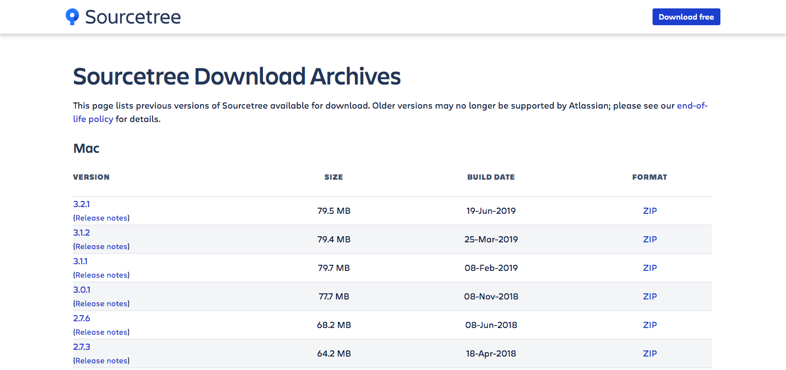
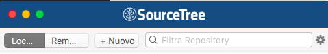
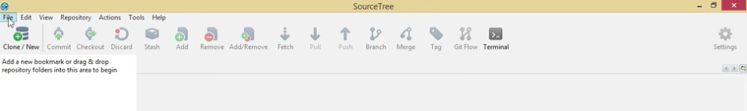
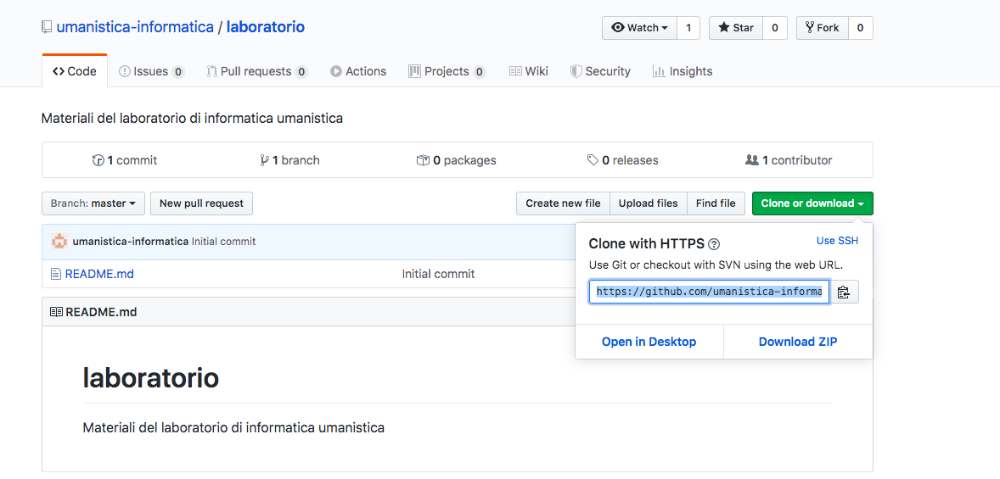
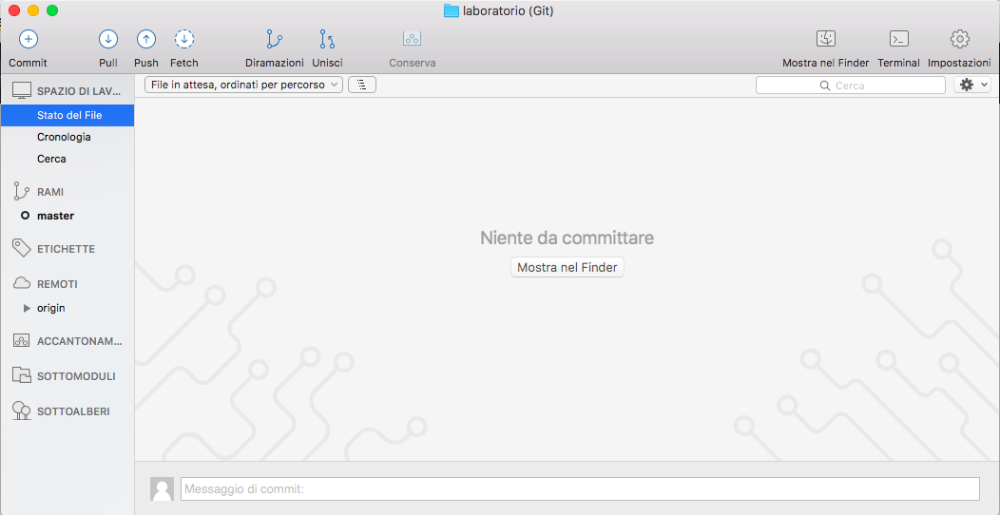

In questo corso utilizziamo [SourceTree](https://www.sourcetreeapp.com/)

_**ATTENZIONE!** Per problemi di compatibilità con vecchi sistemi operativi non aggiornati, non possiamo utilizzare l'utlima versione di SourceTree e dobbiamo selezionare una versione precedente del software SourceTree. Putroppo il sito non offre informazioni su quale versione sia compatibile con il proprio computer, quindi faremo delle prove. Per PC e Mac precedenti il 2014 provate con le versioni 2.5.x (x è un numero variabile)_

1. apriamo il browser e andiamo alla pagina [https://www.sourcetreeapp.com/download-archives](https://www.sourcetreeapp.com/download-archives)

2. a seconda del nostro sistema operativo guardiamo nella tabella che ci serve (Mac o Windows) e selezioniamo un file `zip` (Mac) o `exe` (Windows) da scaricare

3. clicchiamo sul link `ZIP/EXE` a destra

4. accettiamo la licenza per l'utilizzo e clicchiamo su `Download`

**3.2 Installare SourceTree**

1. seguite le **istruzioni successive** a seconda del vostro OS

_**ATTENZIONE!** A seconda della versione di SourceTree scaricata e del sistema operativo con cui lavoriamo le seguenti istruzioni potrebbero variare leggermente (nei passaggi, non nella sostanza)._

###### Mac

 1. andiamo nella cartella `Download` del nostro computer
 2. clicchiamo sul file .zip
  * se ci da un **messaggio di errore** e non fa aprire il file zip/exe: cancelliamo il file dai Download, torniamo sul [sito web](https://www.sourcetreeapp.com/download-archives) e scarichiamo lo zip successivo nella tabella
  * se non da errore, abbiamo trovato la versione compatibile con il nostro sistema
 3. cliccare sull'icona dell'applicazione (decompressa)
 4. drag and drop dell'icona sull'icona della cartella Applicazioni (per spostare l'applicazione dai _Download_ nella cartella _Applicazioni_)
 5. cliccare sull'icona dell'applicazione SourceTree nella cartella _Applicazioni_
 6. spuntare la check box per accettare la licenza (decidere se spuntare Help to improve..) e cliccare su `continue`
 7. seguire le istruzione riportate alla sezione 3.3

###### Windows

 1. clicchiamo su `Run` per far partire l'installer
    * se ci da un **messaggio di errore** e non fa aprire il file exe: cancelliamo il file dai Download, torniamo sul [sito web](https://www.sourcetreeapp.com/download-archives) e scarichiamo il file exe successivo nella tabella
    * se non da errore, abbiamo trovato la versione compatibile con il nostro sistema
  2. seguiamo l'installer e confermiamo tutto (clicchiamo sui vari `Next` e `Install`, `Finish`)
  3. spuntare la check box per accettare la licenza (decidere se spuntare Help to improve..) e cliccare su `continue`
  4. seguire le istruzione riportate alla sezione 3.3

**3.3 Collegare SourceTree all'account github**

1. compare una finestra in cui ci viene chiesto di inserire i dati di un **account**:

 

 * alla voce `Account` selezioniamo dalla lista **`Github`** (non selezionare Bitbucket! un altro provider)
 * inseriamo in `Username` il nome del nostro utente su Github (\*)
 * inseriamo la `Password` che del nostro account su Github
 * clicchiamo su `Continue`

(\*) ovvero inseriamo `nome-utente` che prendiamo da `https://github.com/[nome-utente]/[nome-repository]`

_**ATTENZIONE!** Se compare una finestra in cui vi si chiede di caricare una SSH Key selezionate_ `No`

**3.4 Clonare un repository in locale**

_**ATTENZIONE** A seconda del sistema operativo con cui operiamo troveremo una interfaccia grafica leggermente differente da quella mostrata nelle seguenti immagini. Qui di seguito alcune delle possibilità_

_Una visualizzazione su Mac_

_Una visualizzazione sul Windows_

 1. A seconda dell'interfaccia che abbiamo scegliamo una delle seguenti opzioni:

   * dal menu selezioniamo `File` > `Clone/New` (Windows)
   * dal menu selezioniamo `+ Nuovo` (Mac)
 2. Selezioniamo `Clona da URL` e si apre una finestra per l'inserimento delle informazioni del repository che vogliamo copiare in locale
 3. Torniamo sulla nostra pagina del repository github
 4. clicchiamo il bottone a destra `Clone or Download` e copiamo il link

 5. torniamo nella finestra di SourceTree e inseriamo i seguenti dati:

 
    * `Sorgente URI`: incolliamo il link copiato da github che identifica il nostro repository remoto
    * `Percorso di destinazione`: scegliamo dove vogliamo scaricare la cartella che contiene il repository, e.g. sul desktop in una cartella chiamata con lo stesso nome del repository online
    * `Nome`: lasciamo invariato (o associamo un altro nome per il repository locale)
    * clicchiamo su `Clona`
 6. si apre una nuova finestra simile alla seguente. N.B. Il nome della finestra è il nome del nostro repository ed è quella che useremo per caricare i file sul repository remoto.

 
