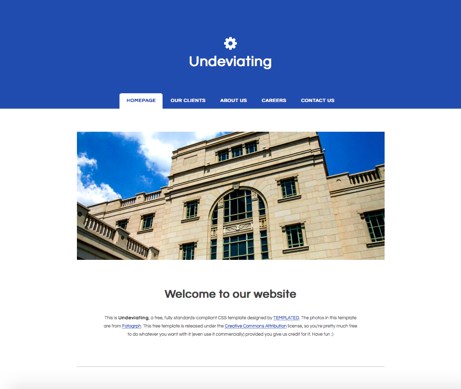

# Lezione 8

## HTML e CSS

I fogli di stile CSS sono file di testo che includono le istruzioni per la visualizzazione (i.e. la grafica) di elementi HTML.

Normalmente vengono salvati salvati con l’estensione `.css` in una sottocartella (i.e. allo stesso livello di index.html) chiamata css. Il file .css principale (possono essercene più di uno) è chiamato `style.css`.

~~~~
corso_iu
  |_ index.html
  |_ css
      |_ style.css
~~~~

#### Richiamare un file CSS in un file HTML

Per richiamare un file CSS in un file HTML, aggiungiamo un elemento `<link>` nell’elemento `<head>`. Il valore dell'attributo `@href` corrisponde al percorso parziale del file .css (ovvero il percorso che parte dal file .html in cui ci si trova e raggiunge il file .css)

Per esempio:

~~~~
<head>
  <title>La mia collezione di CD</title>
  <link rel=”stylesheet” href=”css/style.css”>
</head>
~~~~

#### Richiamare elementi HTML in un file CSS

Un file .css consiste in una serie di istruzioni che seguono la seguente sintassi:

~~~~
selettoreCSS {
   nome-istruzione: valore-istruzione;
   nome-istruzione2: valore-istruzione2;
   ...
}
~~~~

Per richiamare gli elementi del file html a cui si vuole applicare uno stile si utilizzano i **selettori CSS**:

 * nome dell’elemento, applica uno stile a tutti gli elementi con quel nome

 ~~~~
 header { istruzioni }
 section { istruzioni }
 ~~~~

 * percorso (path) di un elemento, applica uno stile all’elemento indicato dal percorso

 ~~~~
 nav ul li { istruzioni }
 section p { istruzioni }
 ~~~~

 * elementi diversi contemporaneamente, applica uno stile a tutti gli elementi separati dalla virgola
 ~~~~
 h2, h3 { istruzioni }
 ~~~~

 * classe di un elemento, applica uno stile a tutti gli elementi il cui valore dell’attributo `@class` è specificato dal selettore

 ~~~~
 .valoreclasse { istruzioni }
 ~~~~

 * identificativo di un elemento, applica uno stile ad un solo elemento, avente quel valore dell’attributo `@id`

 ~~~~
 #valoreid { istruzioni }
 ~~~~

 * pseudoclassi, applica uno stile non ad una classe di elementi ma ad un’azione compiuta su un selettore

 ~~~~
 a:hover { istruzioni }
 ~~~~

## CSS: alcune istruzioni

#### 1. Padding, margini, bordi e contenuto

Margini, padding, bordi possono essere applicati a **blocchi logici** della pagina.

Lo spazio nel web si può misurare in `px` (misura fissa), `%` (relativa all'elemento contenitore), `em` (relativa alla grandezza del font dell'elemento contenitore) e `rem` (relativa alla grandezza di default del font dell'elemento html)

Il padding (spazio tra il contenuto e il bordo) può essere definito per ciascun lato del blocco di testo a cui viene applicato `padding-{lato}`

~~~~
padding-top: 5px;
padding-bottom: 2%;
padding-right: 1em;
padding-left: 1em;
~~~~

oppure può essere applicato, in maniera sintetica a più lati contemporanemente utilizzando `padding`

~~~~
padding: 1em; /* applico a tutti i lati */
padding: 16px 10px; /* applico 16px a top e bottom e 10px a left e right */
padding: 16px 10px 16px 10px; /* applico stili in senso orario partendo da top */
~~~~

Il margine (spazio tra il bordo e l'elemento contenitore dell'elemento selezionato) può essere definito utilizzando `margin`

~~~~
margin-top: 5px;
margin-bottom: 2%;
margin-right: 1em;
margin-left: 1em;

margin: 1em;
margin: 16px 10px;
margin: 16px 10px 16px 10px;
~~~~

N.B. Quando abbiamo `margin: auto;` l'elemento (e il suo contenuto) viene centrato orizzontalmente nella pagina.

Il bordo di un elemento è una linea (inizialmente invisibile) tra il padding e il margine. Per il bordo posso specificare il lato a cui applicarlo, lo spessore, il tipo di linea e il colore.

~~~~
border-top: solid 2px; /* linea continua spessa 2px solo in alto */
border-bottom: dotted 2px; /* linea tratteggiata spessa 2px in basso */
border: solid 5px grey; /* linea continua spessa 2px su tutti i lati, grigia */
border:none; /* nessun bordo */
border-radius: 50%; /* bordo con angoli arrotondati al 50% (un cerchio) */
~~~~

Il contenuto complessiovo di un elemento (che include contenuto testuale, padding, bordo, margine) può essere definito nella sua altezza e larghezza utilizzando le istruzioni `height` e `width`

~~~~
height: 30%;
width: 100%;
~~~~

N.B. come calcolare la reale grandezza di un elemento?

~~~~
width = content + padding (left & right) + border (left & right) + margin (left & right)

height = content + padding (top & bottom) + border (top & bottom) + margin (top & bottom)
~~~~

#### 2. Floating e allineamento

L'istruzione `float` viene utilizzata per disporre elementi blocco all'interno di altri elementi blocco a destra o sinistra (e.g. dato un paragrafo e un'immagine all'interno di una sezione, voglio allineare l'immagine a sinistra del testo, non una dopo l'altro)

~~~~
nav ul li {
  float: left;
}
~~~~

In alternativa, possiamo alterare il comportamento di elementi blocco trasformandoli in elementi inline o, ancora meglio, rimanendo elementi blocco che si comportano come elementi inline.

~~~~
nav ul li {
  display: inline-block;
}
~~~~

Questa istruzione è molto utile per esempio per disporre le voci di menu in orizzontale.

NB. un elemento inline non ha padding e margin, mentre un elemento blocco, o inline-block, può avere padding e margin.

## CSS: stili per il template

**[BUONE PRATICHE]** Nel momento in cui si _implementa_ la grafica del sito in un file CSS bisogna avere a disposizione, in versione semi-definitiva, i seguenti file:

 * i **contenuti** (testi e multimedia) che si vogliono inserire nelle pagine;
 * il **documento HTML** in cui inserire quei contenuti;
 * il **template grafico** che si vuole riprodurre

Si comincia con gli stili per il template (**spazi e blocchi**) e si prosegue con colori, font, multimedia

In questo laboratorio proviamo a riprodurre il seguente template grafico:

**[DISCLAIMER]** Si possono modificare i contenuti, i colori e le icone a piacere, rispettando comunque il template.

Come procedere:

 1. creiamo una cartella in cui inserire i file del nostro sito, e.g. `corso_iu`
 2. apriamo Sublime Text e creiamo un nuovo file vuoto
 3. salviamo il file nella cartella scelta nominandolo `index.html`
 4. inseriamo nel file `index.html` gli elementi **obbligatori** (`<!doctype html>`, `html`, `head`, `body`)
 5. utilizzando il template grafico fornito, inseriamo gli elementi html che sembrano più appropriati per rappresentare i **blocchi logici** della pagina (e.g. `title`, `header`, `nav`, `main`, `footer`, etc.)
 6. inseriamo all'interno dei blocchi logici altri elementi contenitori (e.g. `ul`, `li`, `h1`, `section`, `p`)
 7. inseriamo le voci di menu (`a`) negli elementi appropriati (per il momento _non creiamo_ le pagine html corrispondenti)
 8. inserire negli elementi appropriati alcuni **contenuti** (per il momento _non inseriamo_ icone e bottoni)

Finita la versione semi-definitiva della pagina HTML, passiamo a CSS.

Come procedere:

 1. creiamo una sottocartella chiamata `css` nella cartella `corso_iu`
 2. torniamo su Sublime Text e creiamo un nuovo file vuoto
 3. salviamo il file nella cartella `css` chiamandolo `style.css`
 4. torniamo al nostro file html e inseriamo nell'elemtno `head` il `link` al nostro file `style.css` (vedi sopra)
 5. individuiamo nel file html a quali elementi vanno associate delle **classi** (e.g. elementi multipli che si comportano nello stesso modo o che vanno visualizzati nello stesso modo), degli **identificativi** (e.g. elementi a cui andranno associate delle istruzioni CSS specifiche unicamente per loro) o niente (elementi che sono comunque unici nella pagina, e.g. `footer` )
 6. andiamo nel file css e iniziamo a inserire qualche istruzione relativa agli **spazi** (margini, padding, floating).

**[DISCLAIMER]** L'ordine delle istruzioni in un file css _normalmente_ non è rilevante (e.g. posso inserire istruzioni per `footer` e successivamente per `nav`). L'ordine diventa importante quando un'istruzione **influenza o contraddice** un'altra istruzione (in questo caso l'ultima vince!).
